<h1 align='Center'>
 👑 React Queen's Blood 👑
</h1>

React Queen's Blood is a simplified multiplayer web version of the card game _Queen's Blood_ from _Final Fantasy VII Rebirth_, made using React.

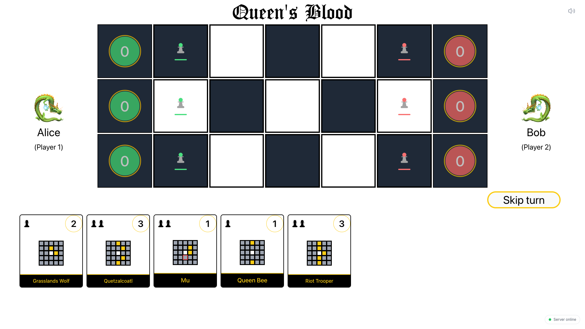

Disclaimer: The game is currently designed specifically for 1080p monitors. I do not own the Intellectual Property of Queen's Blood. I only implemented a simplistic version of the game.

## 🖥️ Technologies used

- React 18 + TypeScript
- React Router + TanStack Query
- Tailwind CSS + Framer Motion
- Zustand for client state management
- Fastify + Socket.io for the game server
- Zod for server payload validation
- Turbo monorepo (`apps/web`, `apps/server`, `packages/shared`)

## 🔧 How to set up the project locally

In your terminal, run:

```sh
$ git clone https://github.com/xRiku/react-queens-blood.git
$ cd react-queens-blood
$ npm i
$ npm run dev
```

This starts both apps in parallel:

- Web client at `http://localhost:5173`
- Socket server at `http://localhost:4000`

If needed, run each app separately:

```sh
$ npm run dev -w @queens-blood/server
$ npm run dev -w @queens-blood/web
```

Optional environment variables:

- `PORT` (server port, default `4000`)
- `CORS_ORIGIN` (comma-separated allowed origins)
- `VITE_SOCKET_URL` (client socket URL)

### 🌟 Optimal way to play

Part of the fun in a Queen's Blood game is not having access to the opponent's hand. So the optimal way to play is setting up the server and playing on two different devices in the same network. This requires that the 5173 port of the device running the app is exposed to the LAN.

Once the port is exposed, access the application in the other computer's browser using the following address `<IP_RUNNING_THE_APP>:5173`. In order to acquire the IP, run the following command:

Linux

```
ifconfig | grep 192.168
```

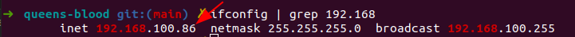

Windows

```
ipconfig
```

On Windows, the IP is located after `IPv4 Address`.

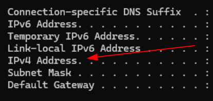

## 🧩 How to play

### ✨ Feature highlights

- Multiplayer rooms with shareable 6-digit room code
- Ready-room confirmation before each match starts
- Play against a local bot without the server
- Card effects system (continuous buffs + on-place debuffs)
- Card destruction when an on-place debuff drops a card to 0
- End-game rematch flow with accept/decline status
- Deck Builder (15-card deck, max 2 copies per card)
- Rules page + full card gallery
- Mobile-friendly board interactions (tap to preview, then confirm)

### ➡️ Entering the game

You can either create a game room or join a game. Each room has its own game ID and you can only have two players per room.

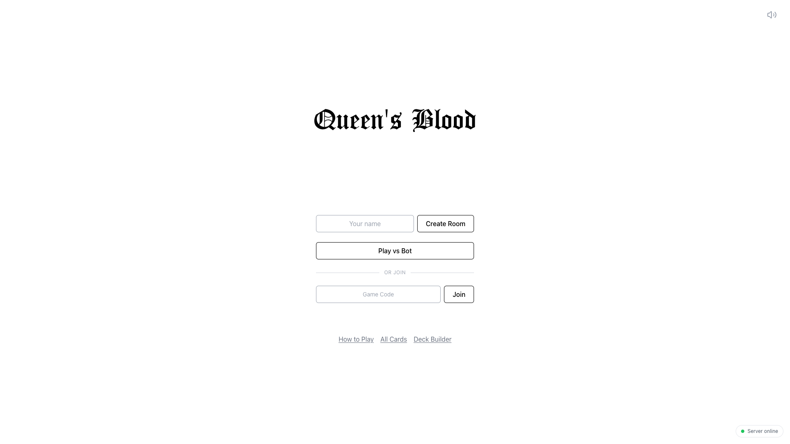

To start a new game, type your name and click the `Create Room` button. A random game ID is generated and shown while waiting for the second player.

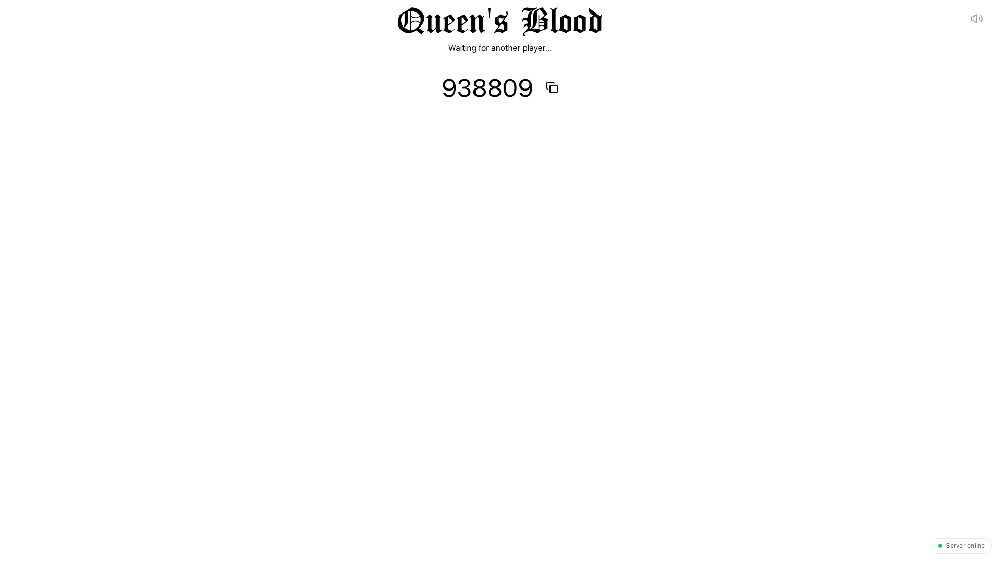

This game ID is used by the second player. To join, enter the code in the join input and click `Join`, then enter your player name.

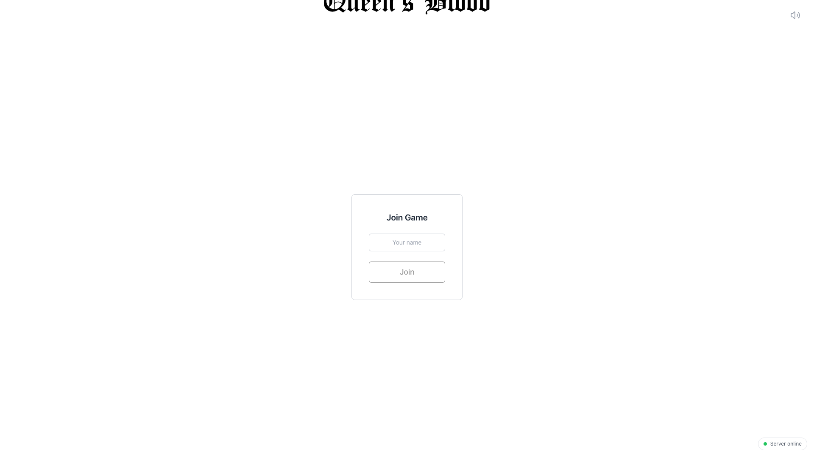

After clicking `Join`, both players enter a ready room. The match starts after both confirm they are ready. The room creator is always Player 1.

### 📜 Rules

The game is composed of a board and a deck of 15 cards. The board contains three rows and five playable columns. Each player has a score for each row. Points are scored by placing cards on the board. Whoever has the highest sum of the points for each row wins.

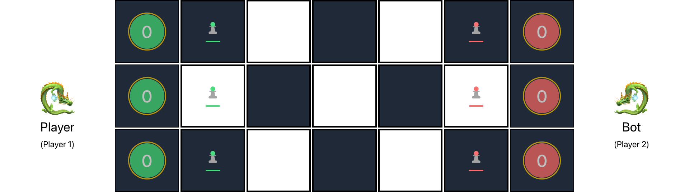

The user playing is always displayed in green, on the left side, and the opponent in red, on the right side. The first and last column of the board represents the total score for that row in each player's respective color. You may also note that there are pawns in each row and each side of the board. In React Queen's Blood, you can only place a card in a tile with a pawn in it and if it is from your color, which is green. The tile can contain 1-3 pawns, which represent the cost of the card (to be explained).

Each card has 4 key pieces of information. The text at the bottom is the card name, and each deck can only contain 2 copies of the same card. The pawn icon at the top-left indicates the card cost (1-3). The number at the top-right indicates the card score.

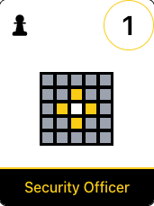

Each card also has a 5x5 inner grid that defines how it interacts with the board. When you place a card, it can also place pawns and expand your available positions. The inner grid uses three tile colors: **Gray** tiles have no effect, the **White** tile is the card placement position, and **Yellow** tiles are where pawns are placed relative to the played card.

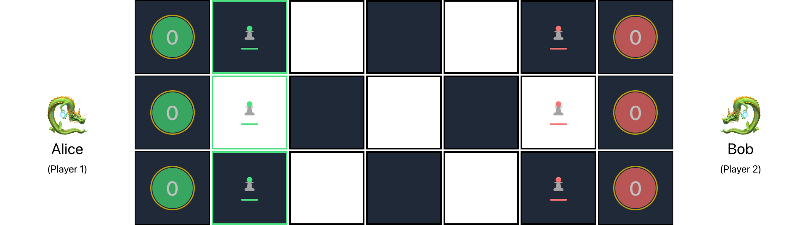

:warning: If a yellow target tile already contains your pawn(s), one pawn is added to that tile. If it contains opponent pawn(s), all pawns on that tile are converted to your color.

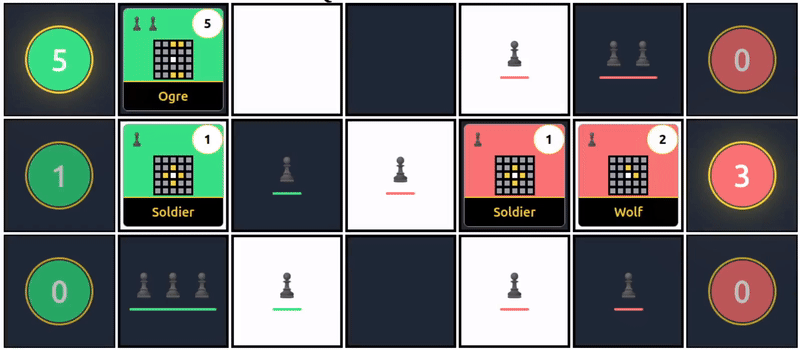

The game starts with Player 1. Both players begin with 5 cards. On each following turn, the active player draws 1 random card before acting. Each turn, you either place a card on the board or skip by clicking `Skip Turn`. Placing a card adds its score to that row for the player who placed it. The game ends when both players skip consecutively. At the end, each row is scored independently: if your row score is higher, that row's score is added to your total; if you lose or tie the row, you gain 0 from it. The highest total wins.

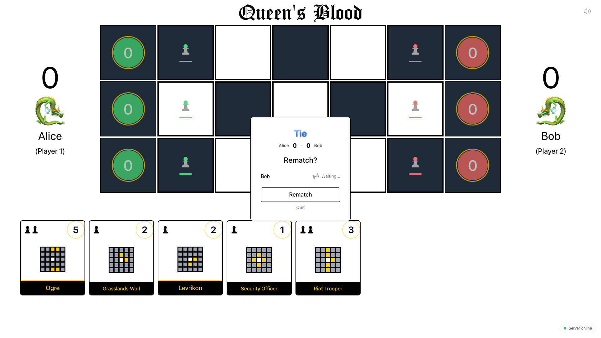

## 🚧 Roadmap

Originally planned items, updated with current status:

- [x] Add buffs and debuffs
- [x] Add a pawn preview for the selected card
- [x] Add a tile highlight for available tiles to place the card
- [x] Add more cards
- [x] Add responsive design
- [x] Add a rematch button
- [x] Add deck builder
- [x] Add play-vs-bot mode
- [x] Add ready-room confirmation before game start
- [ ] Add a mulligan phase to prevent cards with high cost in the first hand
- [ ] Add chat/emotes between players
- [ ] Add turn timer to prevent endless matches
- [ ] Improve code legibility
- [ ] Improve animations and timings (such as initial draw and card use)
- [ ] Improve SFX
- [ ] Improve card visual design
- [ ] Create database to store user and match data
- [ ] Deploy and document all environments

## 👥 Contributing

Feel free to submit pull requests, create issues with suggestions or anything you find valuable to the project.
