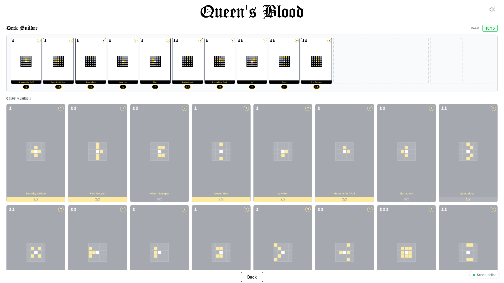
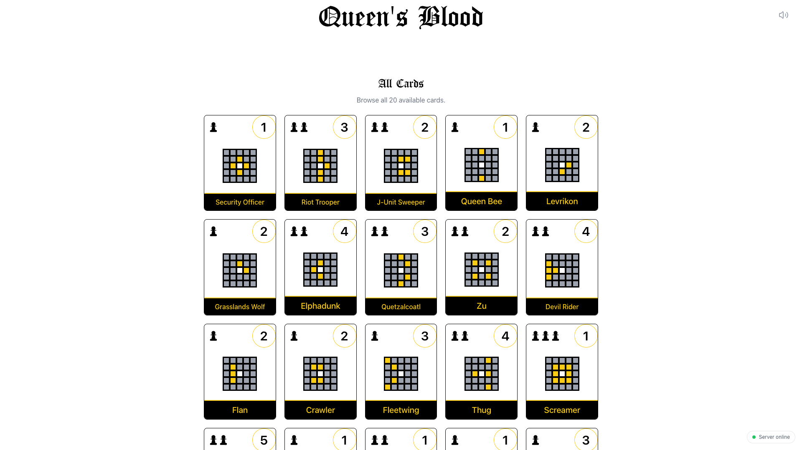
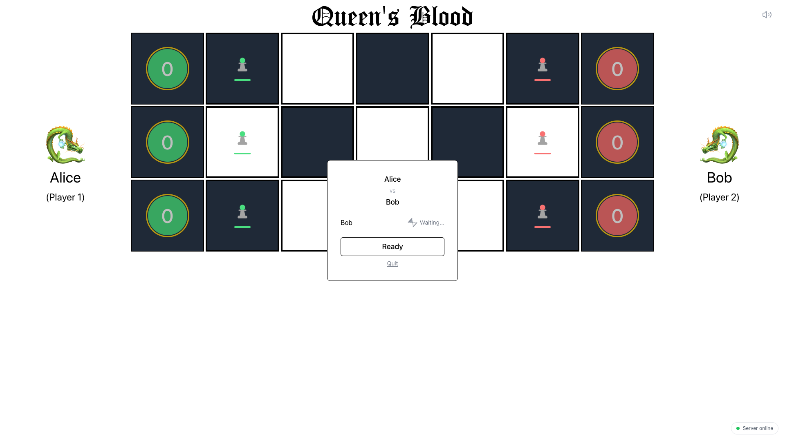
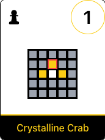
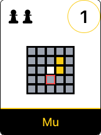
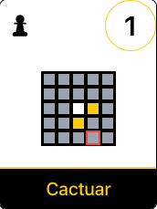
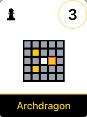
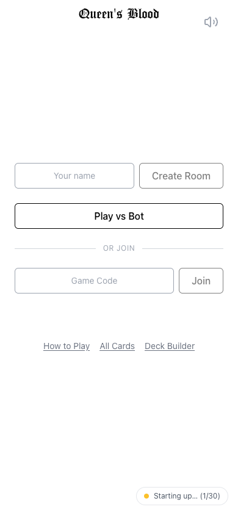
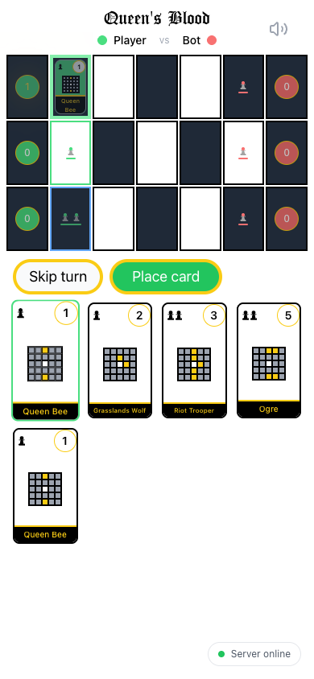

<h1 align='Center'>
 👑 React Queen's Blood 👑
</h1>

React Queen's Blood is a multiplayer web implementation inspired by the Queen's Blood minigame from _Final Fantasy VII Rebirth_.


Disclaimer: I do not own the Queen's Blood IP. This project is a fan-made implementation.

## What changed since 2024

### Gameplay

- Added ready-room confirmation before each match starts
- Added rematch flow with accept/decline statuses
- Added play-vs-bot mode
- Added card effects (continuous buffs + on-place debuffs)
- Added card destruction when an on-place debuff drops a card to 0

### Product/UI

- Added Deck Builder with 15-card validation and max 2 copies per card
- Added All Cards page as a card glossary
- Added mobile-friendly interactions (tap to preview, then confirm)
- Added live server-status indicator (online, waking, offline)

### Engineering

- Consolidated game rules in `packages/shared` for reuse between server and client
- Added shared game-logic tests with Vitest
- Added payload validation with Zod on server events

## Stack

- React + TypeScript (Vite)
- React Router + TanStack Query
- Tailwind CSS + Framer Motion
- Zustand
- Fastify + Socket.IO
- Zod + Vitest
- Turbo monorepo (`apps/web`, `apps/server`, `packages/shared`)

## Local setup

```sh
$ git clone https://github.com/xRiku/react-queens-blood.git
$ cd react-queens-blood
$ npm install
$ npm run dev
```

- Web client: `http://localhost:5173`
- Server: `http://localhost:4000`

Run apps separately if needed:

```sh
$ npm run dev -w @queens-blood/server
$ npm run dev -w @queens-blood/web
```

Optional environment variables:

- `PORT` (default `4000`)
- `CORS_ORIGIN` (comma-separated allowed origins)
- `VITE_SOCKET_URL` (socket URL used by the client)

For two-device play on the same network, see `docs/local-network-setup.md`.

## Feature highlights

- Multiplayer rooms with shareable 6-digit room code
- Ready-room gate before gameplay starts
- End-game rematch flow
- Play vs bot without running the server
- Deck Builder and All Cards glossary
- Responsive UI for desktop and mobile

## UI snapshots





Server status indicator:

- Online state


- Startup/waking state


## Quick match flow

1. Create a room or join one with a 6-digit code.


2. Room creator receives a game code while waiting for the second player.


3. Player two joins with code + player name.


4. Both players confirm readiness in the ready room.



5. Match ends when both players skip consecutively; result can be win/lose/tie, then rematch flow starts.


## Rules

- The board has 3 rows and 5 playable columns.
- Each player has row scores; winning row scores are added to the final total.
- A card can be placed only on a valid tile with your pawn color and enough pawns for cost.
- Cards place pawns based on their 5x5 pattern.


Card anatomy:

- Top-left: cost (1-3)
- Top-right: power
- Bottom: card name
- Center grid: pawn placement pattern


Grid legend:

- Gray: no effect
- White: card placement tile
- Yellow: tiles affected by this card pattern


If a yellow target already has your pawn(s), one pawn is added. If it has opponent pawn(s), those pawns are converted.


## Card effects

- Continuous effects stay active while the source card remains in play.
- On-place effects apply once when the card is played.
- Debuffs do not reduce power below 0.
- If an on-place debuff drops a card to 0, that card is destroyed.

Card images below are reference captures from the All Cards glossary.

Continuous buffs (ally):

- `Crystalline Crab` (+2)



- `Mu` (+1)



- `Cactuar` (+3)



On-place debuff (enemy):

- `Archdragon` (-3 on play)



## Responsive design

The UI supports desktop and mobile layouts, including touch-friendly card interactions.



Active game on mobile with a selected card, tile preview, and `Place card` action:



## Tech and architecture

- `apps/web`: React client (routes, game UI, bot mode, deck builder, card glossary)
- `apps/server`: Fastify + Socket.IO room/match lifecycle and realtime events
- `packages/shared`: board logic, card/deck data, and shared types

## Roadmap

### Completed

- [x] Add buffs and debuffs
- [x] Add a pawn preview for selected cards
- [x] Add tile highlights for valid placement
- [x] Add more cards
- [x] Add responsive design
- [x] Add rematch flow
- [x] Add deck builder
- [x] Add play-vs-bot mode
- [x] Add ready-room confirmation before game start

### Next

- [ ] Add mulligan phase to reduce high-cost first hands
- [ ] Add chat/emotes between players
- [ ] Add turn timer to prevent endless matches
- [ ] Improve code readability
- [ ] Improve animations and timings (initial draw and card usage)
- [ ] Improve SFX
- [ ] Improve card visual design
- [ ] Create a database for user and match data
- [ ] Deploy and document all environments

## Contributing

Pull requests and issues are welcome.
