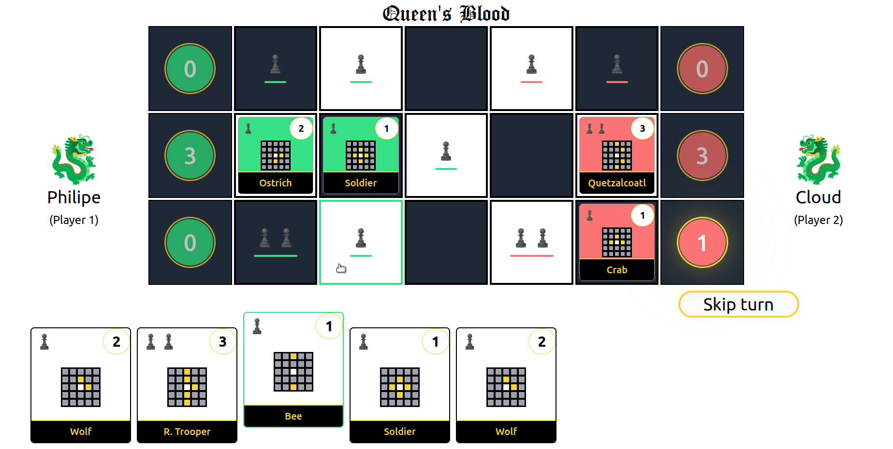
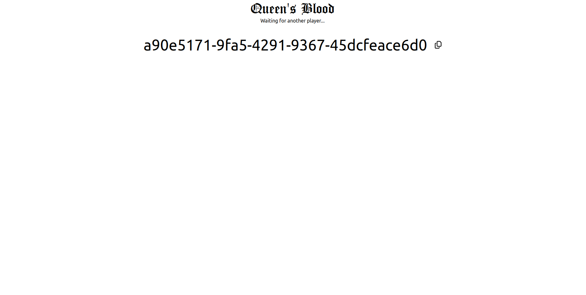
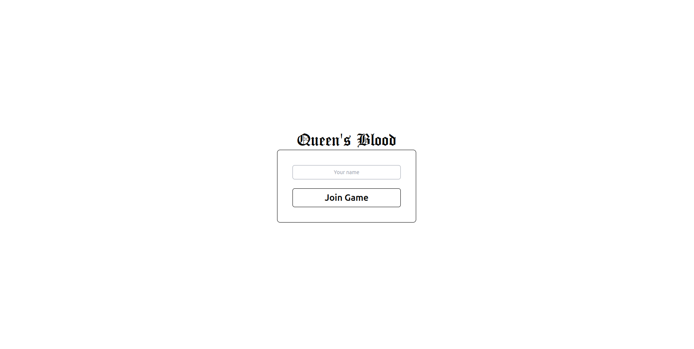
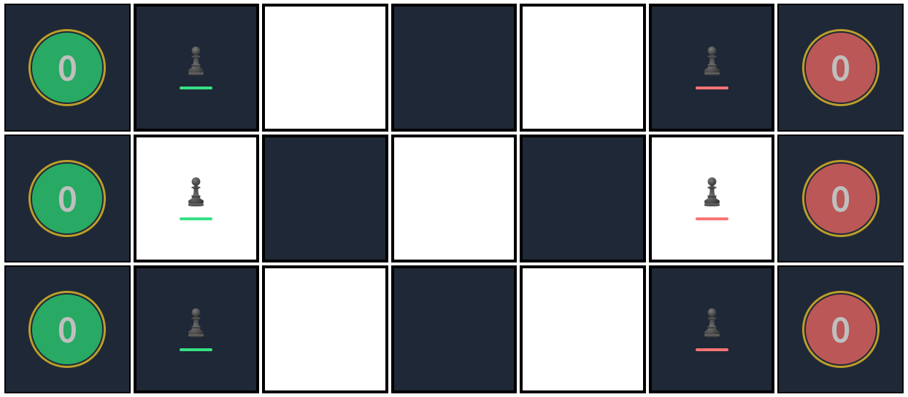
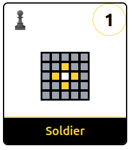

<h1 align='Center'>
 👑 React Queen's Blood 👑
</h1>

React Queen's Blood is a multiplayer web version of the card game _Queen's Blood_ in _Final Fantasy VII Rebirth_, made using React.



Disclaimer: The game is currently designed specifically for 1080p monitors.

## 🖥️ Technologies used

- React 18 and Typescript for code structure
- Tailwind CSS for styling
- Zustand for global state management
- Framer Motion for animations
- Socket.io for socket connection

## 🔧 How to set up the project locally

In your terminal, run:

```sh
$ git clone https://github.com/xRiku/react-queens-blood.git
$ cd react-queens-blood
$ npm i
```

Then you have to set up both the server and the application.

To set up the **application** you have to run

```sh
 $ npm run dev
```

To set up the **server** you just have to run

```sh
 $ npm run server
```

After setting up everything, the application is accesible at `localhost:5173` and you're ready to play.

### 🌟 Optimal way to play

Part of the fun in a Queen's Blood game is not having access to the opponent's hand. So the optimal way to play is setting up the server and playing on two different devices in the same network. This requires that the 5173 port of the device running the app is exposed to the LAN.

Once the port is exposed, access the application in the other computer's browser using the following address `<IP_RUNNING_THE_APP>:5173`. In order to acquire the IP, run the following command:

Linux

```
ifconfig | grep 192.168
```


Windows

```
ipconfig
```

On Windows, the IP is located after `IPv4 Address`.


## 🧩 How to play

### ➡️ Entering the game

You can either create a game room or join a game. Each room has its own game ID and you can only have two players per room.


To start a new game, type your name and click the `Start Game` button. A random game ID is generated and showcased in the waiting room.



This game ID is meant to be used when joining a new game. In order to join a game, input the ID in the join game input field and click `Join Game`. After that, the joining player will be prompted to type a name.



After clicking the `Join Game` button, the game will start. The player that creates the room will always be Player 1.

### 📜 Rules

The game is composed of a board and a deck of 15 cards. The board contains three rows and five playable columns. Each player has a score for each row. Points are scored by placing cards on the board. Whoever has the highest sum of the points for each row wins.



The user playing is always displayed in green, on the left side, and the opponent in red, on the right side. The first and last column of the board represents the total score for that row in each player's respective color. You may also note that there are pawns in each row and each side of the board. In React Queen's Blood, you can only place a card in a tile with a pawn in it and if it is from your color, which is green. The tile can contain 1-3 pawns, which represent the cost of the card (to be explained).

The card is built of 4 key informations. The text on the bottom represents the card name. Each deck can only contain 2 cards of the same name. The pawn piece on the top left indicates the cost to play that card on the board. It varies from 1-3. The number at the top right indicates the score of that card.



Lastly, each card has a 5x5 board in the middle that informs how the card interacts with the game board. When placing a card in React Queen's Blood it has the ability to also place pawns for you to increase board presence. This inner board in the card is composed of tiles of three different colors. The **White** tile is the position in the game board where the card is placed. The **Yellow** tiles are the location of the pawns placed relative to the white tile after the card is placed in the game board. The **Gray** tiles do not have any effect and are just the rest of the tile postions.

In the first round of the game each player receives 5 cards. To pass a turn, there are two options: one is to place a card and the other is to skip the turn. When placing a card in a row, the score of the card is summed into the row score for that player. In each but the first turn, you draw a random card from the deck. The game ends when the two players skip the turn consecutively. When the game ends, for each row, if the player's score for that row is greater than the opponent's, the score for that row is summed to the total score. If you either lose in that row or get a draw, you sum 0 to the total score. Wins whoever has the highest total score in the end.

## 🚧 Room for improvement

List of ideas already planned out to be implemented:

- [ ] Add buffs and debuffs
- [ ] Improve code legibility
- [ ] Improve animations and timings (such as the initial draw of the card or when the card is used)
- [ ] Add a pawn preview for the selected card
- [ ] Add a tile highlight for
- [ ] Add a mulligan phase to prevent cards with high cost in the first hand
- [ ] Add more balanced cards
- [ ] Improve SFX
- [ ] Add docker support
- [ ] Add responsive design

## 👥 Contributing

Feel free to submit pull requests, create issues with suggestions or anything you find valuable to the project.
