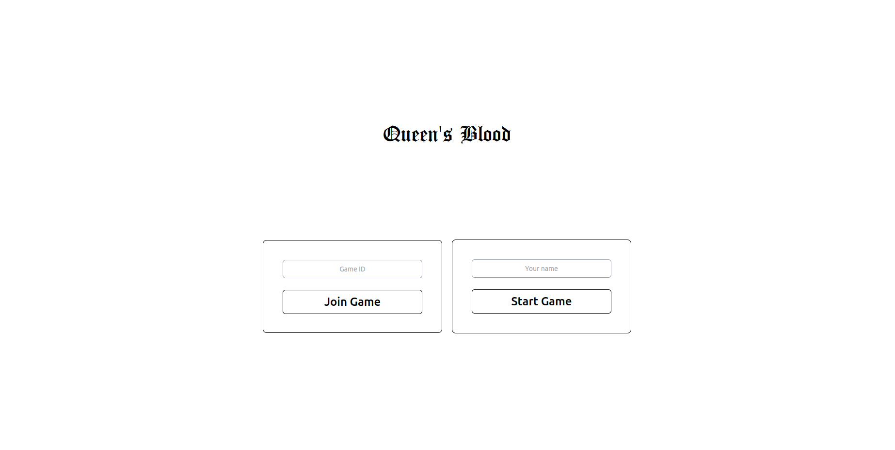

<h1 align='Center'>
 👑 React Queen's Blood 👑
</h1>

React Queen's Blood is a multiplayer web version of the card game _Queen's Blood_ in _Final Fantasy VII Rebirth_, made using React.


Disclaimer: The game is currently designed specifically for 1080p monitors.

## 🖥️ Technologies used

- React 18 and Typescript for code structure
- Tailwind CSS for styling
- Zustand for global state management
- Framer Motion for animations
- Socket.io for socket connection

## 🔧 How to set up the project locally

In your terminal, run:

```sh
$ git clone https://github.com/xRiku/react-queens-blood.git
$ cd react-queens-blood
$ npm i
```

Then you have to set up both the server and the application.

To set up the **application** you have to run

```sh
 $ npm run dev
```

To set up the **server** you just have to run

```sh
 $ npm run server
```

After setting up everything, the application is accesible at `localhost:5173` and you're ready to play.

### Optimal way to play

Part of the fun in a Queen's Blood game is not having access to the opponent's hand. So the optimal way to play is setting up the server and playing on two different devices in the same network. This requires that the 5173 port of the device running the app is exposed to the LAN.

Once the port is exposed, access the application in the other computer's browser using the following address `<IP_RUNNING_THE_APP>:5173`. In order to acquire the IP, run the following command:

Linux

```
ifconfig | grep 192.168
```


Windows

```
ipconfig
```

On Windows, the IP is located after `IPv4 Address`.


## 🧩 How to play

### Entering the game

You can either create a game room or join a game where each room has its own game ID and you can only have two players per room.



### Rules

## 🚧 Room for improvement

List of ideas already planned out to be implemented:

- [ ] Add buffs and debuffs
- [ ] Improve code legibility
- [ ] Improve animations and timings (such as the initial draw of the card or when the card is used)
- [ ] Add a pawn preview for the selected card
- [ ] Add a tile highlight for
- [ ] Add a mulligan phase to prevent cards with high cost in the first hand
- [ ] Add more balanced cards
- [ ] Improve SFX
- [ ] Add docker support
- [ ] Add responsive design

## 👥 Contributing

Feel free to submit pull requests, create issues with suggestions or anything you find valuable to the project.
